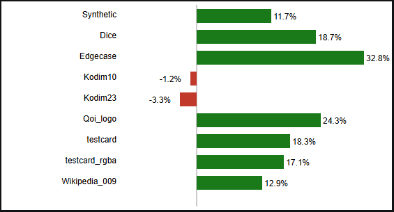

# qoi-asm : x86 ASM implementation of the QOI encoder

This repo contains an assembly code implementation of the qoi encoder function (`qoi_encode_asm`) along with
a test harness and benchmark suite.

The test harness demonstrates that it produces the same inputs as the C reference encoder across the test data
set provided at https://qoiformat.org/qoi_test_images.zip. (N.B. it does not exactly match the rust QOI crate, which has an extra optimization and produces slightly different output on some tests).

The benchmark harness tests performance against the reference encoder and the Rust QOI crate.

Results of this testing:

| Test Case     | Reference Encoder | QOI Crate | ASM Encoder | Speedup |
| ------------- | ----------------- | --------- | ----------- | ------- |
| Synthetic     | 0.07769           | 0.088935  | 0.06858     | 11.7%   |
| Dice          | 1.1212            | 1.1766    | 0.91123     | 18.7%   |
| Edgecase      | 0.022584          | 0.022656  | 0.015187    | 32.8%   |
| Kodim10       | 3.555             | 2.9042    | 2.939       | -1.2%   |
| Kodim23       | 3.7214            | 2.8932    | 2.988       | -3.3%   |
| Qoi_logo      | 0.12894           | 0.13787   | 0.097672    | 24.3%   |
| testcard      | 0.14089           | 0.14017   | 0.11459     | 18.3%   |
| testcard_rgba | 0.14571           | 0.14693   | 0.12086     | 17.1%   |
| Wikipedia_009 | 8.9184            | 8.3092    | 7.2409      | 12.9%   |

In every case, the ASM implementation is quicker than the reference implementation and also quicker than the rust QOI crate for non-photographic cases.

The rust QOI crate is a tiny sliver faster on the photographic tests whilst producing slightly different output to the reference encode.

I did experiment with vectorized read ahead of "same pixel" runs, which further sped up the non-photographic case but noticeably worsened performance in photographic cases. I eventually reverted this since I could not mitigate the slowdown for photographs (which are the slowest by far to encode).

Whilst it is in general a faster encoder it's probably not fast enough to justify losing portability (and readability) versus the higher level language implementations.

## Speedup Chart

  

